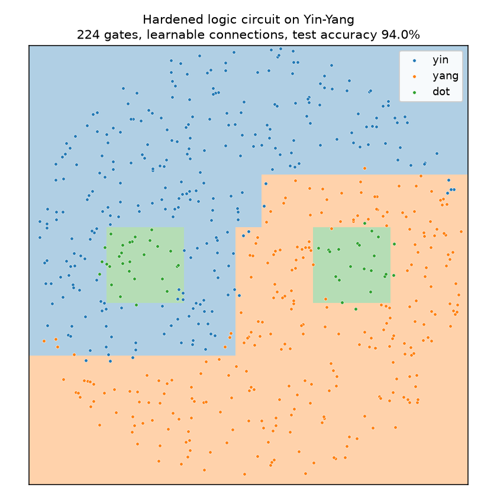

# wirelogic

[](https://github.com/itsbrendandang/wirelogic/actions/workflows/ci.yml)

A compact, CPU-friendly reference implementation of **fully-trainable differentiable logic gate networks**, where the wiring between gates is learned rather than fixed.

It reproduces the central mechanism of Mommen et al., ["Fully Trainable Deep Differentiable Logic Gate Networks and Lookup Table Networks"](https://arxiv.org/abs/2607.09399) (arXiv:2607.09399, July 2026), on the small Yin-Yang benchmark, and it hardens the trained network into a concrete integer-only logic circuit that runs with no floating point.



The regions above are drawn by the *hardened* circuit, not the soft model, so this is literally what the exported logic gates compute.
The blocky, axis-aligned boundaries are the honest fingerprint of a network built from boolean gates over thermometer-encoded inputs.
Regenerate the figure with `uv run --extra viz python scripts/plot_decision_boundary.py`.

## The idea in one paragraph

A logic gate network is a neural network whose neurons are two-input boolean gates (AND, XOR, NAND, and the other thirteen).
Each wire carries a probability that its bit is `1`, and every gate has an exact differentiable relaxation of its truth table, so a whole network of gates can be trained by gradient descent (Petersen et al., 2022).
The original formulation wires each gate to two random sources and leaves that wiring frozen for the entire run.
The contribution of arXiv:2607.09399, implemented here, is to make the wiring itself trainable: each gate input keeps a distribution over a candidate set of sources and learns which source has the highest merit, using a straight-through estimator so the forward pass commits to a single wire while gradients still reach every candidate.
Freeing the connections lets a much smaller network reach the same accuracy, because gates are no longer stuck with an unlucky random wiring.

## Result

Fixed versus learnable connections on Yin-Yang, at an identical gate budget (224 gates, `--hidden 64,64 --out-wires 96`, 400 epochs, seed 0):

| connections | gates | test accuracy (soft) | test accuracy (hardened circuit) |
| --- | --- | --- | --- |
| fixed (Petersen-style) | 224 | 87.7% | 87.7% |
| learnable (this repo / the paper) | 224 | **94.0%** | **94.0%** |

Two things to read off this table.
Learning the wiring adds about six accuracy points at zero extra gate cost, which is the paper's headline claim in miniature.
And the hardened, integer-only circuit reproduces the trained soft model exactly (0.9400 equals 0.9400), because the encoded inputs are binary and hardening is a lossless arg-max over already-peaked distributions.

Reproduce it with:

```bash
uv run wirelogic --compare --epochs 400 --hidden 64,64 --out-wires 96 --seed 0
```

Numbers will match on any machine; the run is fully seeded and takes about thirty seconds on a laptop CPU.

## Install

```bash
git clone https://github.com/itsbrendandang/wirelogic
cd wirelogic
uv sync --extra dev
```

## Quickstart

Train a single model and report soft and hardened accuracy:

```bash
uv run wirelogic --connections learnable --epochs 400 --hidden 64,64 --out-wires 96
```

Use it as a library:

```python
import torch
from wirelogic import LogicGateNetwork, ModelConfig, harden
from wirelogic.data import make_yin_yang
from wirelogic.encode import thermometer_encode

x, y = make_yin_yang(2000, seed=0)
x_bits = thermometer_encode(x, bits=16)  # 4 features -> 64 binary wires

cfg = ModelConfig(in_features=64, hidden=(64, 64), out_wires=96, num_classes=3)
model = LogicGateNetwork(cfg, generator=torch.Generator().manual_seed(0))
# ... train model with Adam + cross-entropy (see wirelogic/train.py) ...

circuit = harden(model)          # frozen, integer-only boolean circuit
preds = circuit.predict(x_bits)  # runs with table look-ups, no floating point
```

## How it fits together

- `gates.py`: the sixteen two-input boolean gates in soft (differentiable) and hard (truth-table) form, indexed so `1` is AND, `6` is XOR, `7` is OR, `14` is NAND.
- `layers.py`: `LogicLayer` with fixed or learnable connections, the straight-through connection selector, and the `GroupSum` head that turns output wires into class scores.
- `encode.py`: a thermometer encoder that binarises real features into `{0, 1}` wires, so the hardened circuit sees exactly the same inputs as the soft model.
- `data.py`: the Yin-Yang dataset (Kriener et al., 2022).
- `model.py`: the stacked network and its configuration.
- `harden.py`: discretisation into a `HardCircuit` plus a fast integer forward pass.
- `train.py`: the training loop and the `--compare` experiment.

## What is and is not implemented

This repository implements the learnable-connection logic gate network (LGN) and demonstrates it on Yin-Yang, with lossless hardening verified in the test suite.
It deliberately keeps the scope small and honest: the accuracy figures above are the ones this code actually produces, not the paper's large-scale MNIST or Fashion-MNIST numbers.
The paper's lookup-table-network (LUTN) variant and its deeper ten-layer stability results are out of scope for this reference.
The pieces here, connection distributions with straight-through selection, constant-gate trimming, and the GroupSum classifier, are the same mechanisms the paper scales up, so extending to MNIST is mostly a matter of larger layers and more compute.

## Tests

```bash
uv run pytest      # 12 tests: gate semantics, straight-through gradients, lossless hardening
uv run ruff check .
uv run mypy src tests
```

The hardening tests are the load-bearing ones.
`test_vectorized_hard_forward_matches_reference` checks the fast integer circuit against a naive Python evaluator, and `test_one_hot_soft_model_matches_hard_circuit` checks that in the discrete (one-hot) limit the differentiable model and the hardened circuit agree bit for bit.

## Citation

```bibtex
@article{mommen2026fullytrainable,
  title   = {Fully Trainable Deep Differentiable Logic Gate Networks and Lookup Table Networks},
  author  = {Mommen, Wout and others},
  journal = {arXiv preprint arXiv:2607.09399},
  year    = {2026}
}
```

This is an independent reimplementation for study and is not affiliated with the paper's authors.

## License

MIT.
See [LICENSE](LICENSE).
